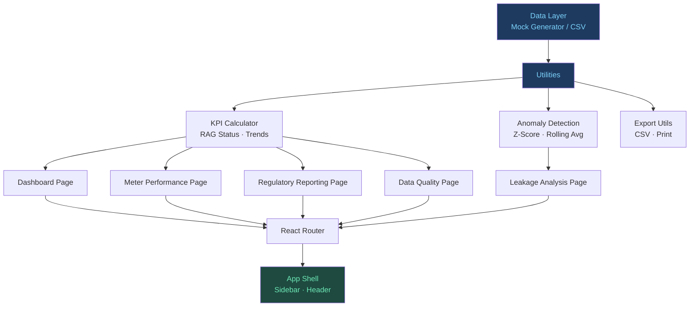

# 💧 Smart Water Metering Analytics Platform


> A production-quality analytics dashboard simulating the end-to-end smart metering programme analytics stack for a regulated UK water company — covering KPI performance reporting, leakage detection, regulatory submissions, and data quality management.

**🔗 Live Demo**: [View Dashboard →](https://Angaarpotta.github.io/smart-water-metering-analytics/)

---

## 📸 Screenshots

| Dashboard | Leakage Analysis |
|-----------|-----------------|
|  |  |

| Regulatory Reporting | Data Quality |
|---------------------|-------------|
|  |  |

---

## 🎯 About This Project

This platform was built to demonstrate the full analytical workflow of a **Smart Metering Analyst** in a regulated UK water company context. It replicates the real-world responsibilities of:

- Producing timely performance reports within agreed SLAs
- Collating and analysing data from multiple operational sources (AMS Provider, SOC Direct, Manual)
- Tracking KPIs against internal targets **and** external regulatory thresholds (Ofwat PR24, MOSL, Water UK)
- Detecting leakage anomalies through statistical methods
- Supporting regulatory submissions with formatted, audit-ready exports
- Monitoring and improving data quality across the metering programme

---

## 🏗️ Architecture



---

## 🔑 Key Features

### 📊 Dashboard
- 8 KPI cards with **RAG (Red/Amber/Green) status** vs. internal and Ofwat regulatory targets
- Month-over-month trend indicators with directional arrows
- Smart meter rollout radial gauge (Recharts RadialBarChart)
- Daily read volume stacked bar chart (AMS / SOC / Manual split)
- 12-month read rate trend with Ofwat 97% threshold reference line
- Per-capita consumption trend vs. Ofwat 140 L/p/d target
- One-click **CSV export** of full KPI history

### ⚙️ Meter Performance
- Filterable by period (7/30/90 days), zone, and data source
- Area chart of daily read rate over time
- Stacked bar chart of reads by AMS / SOC / Manual source
- Zone performance summary table with read rate, consumption, alerts, and data quality
- Meter status fleet breakdown (Active / Comms Fault / Low Battery / Tamper)

### 💧 Leakage Analysis
- **Z-score anomaly detection** engine (`zScore ≥ 2.5` flags leakage events)
- 90-day consumption time-series with 7-day rolling average overlay
- Anomaly markers on consumption chart
- Z-score vs. estimated volume loss scatter plot (colour-coded by severity)
- Zone-level event distribution bar chart (Critical / High / Medium / Low)
- Filterable alert feed (120 events) with severity badges and status tracking
- CSV export of all leakage events

### 📋 Regulatory Reporting
- **Three-tab view**: MOSL · Ofwat (PR24) · Water UK
- Compliance progress bars per metric (actual vs. target)
- RAG-coded compliance status with regulatory reference values
- 12-month MOSL score trend chart
- Monthly submission history table (MOSL monthly / Ofwat quarterly / Water UK bi-annual)
- MOSL-formatted **CSV export** ready for submission
- Print-to-PDF report button

### 🛡️ Data Quality
- 8 validation rule checks with Pass / Warn / Fail outcomes
- Pie chart of records affected by issue type
- Issues-by-source severity breakdown (stacked bar)
- Filterable issue log (type, severity, source, resolved status)
- CSV export of all data quality issues

---

## 🛠️ Tech Stack

| Category | Technology |
|----------|-----------|
| Framework | React 18 + Vite 5 |
| Routing | React Router v6 |
| Charts | Recharts 2.12 |
| Icons | Lucide React |
| Styling | Vanilla CSS (custom design system) |
| Data | Synthetic mock data (seeded, reproducible) |
| CI/CD | GitHub Actions → GitHub Pages |

---

## 🚀 Getting Started

### Prerequisites
- [Node.js](https://nodejs.org/) v18 or later
- npm v9 or later

### Installation

```bash
# Clone the repo
git clone https://github.com/Angaarpotta/smart-water-metering-analytics.git
cd smart-water-metering-analytics

# Install dependencies
npm install

# Start the development server
npm run dev
```

Then open [http://localhost:5173/smart-water-metering-analytics/](http://localhost:5173/smart-water-metering-analytics/)

### Other Commands

```bash
npm run build      # Production build
npm run preview    # Preview production build locally
npm run lint       # ESLint check
```

---

## 📁 Project Structure

```
src/
├── components/
│   ├── charts/
│   │   └── ChartComponents.jsx   # CustomTooltip, ChartCard
│   └── layout/
│       ├── Header.jsx
│       └── Sidebar.jsx
├── data/
│   └── mockDataGenerator.js      # Reproducible synthetic data (seeded RNG)
├── pages/
│   ├── Dashboard.jsx
│   ├── MeterPerformance.jsx
│   ├── LeakageAnalysis.jsx
│   ├── RegulatoryReporting.jsx
│   └── DataQuality.jsx
├── utils/
│   ├── anomalyDetection.js       # Z-score & rolling average engine
│   ├── exportUtils.js            # CSV download & print utilities
│   └── kpiCalculator.js          # RAG status, trend, KPI summary
├── App.jsx
├── index.css                     # Design system (tokens, layout, components)
└── main.jsx
```

---

## 📐 Data Model

### Simulated Dataset
| Entity | Volume | Notes |
|--------|--------|-------|
| Meters | 500 | Across 5 geographic zones |
| KPI History | 24 months | Jul 2024 – Jun 2026 |
| Daily Read Records | 90 days | AMS / SOC / Manual split |
| Leakage Events | 120 | With Z-score and volume estimates |
| Data Quality Issues | 80 | Seeded across 7 issue types |

### Anomaly Detection Method
Uses a **Z-score approach** against the full consumption population:

```
Z = (x - μ) / σ

where:
  x  = observed consumption
  μ  = population mean
  σ  = population standard deviation

Thresholds:
  Z ≥ 2.5 → Flagged as anomaly
  Z ≥ 2.5 → Low severity
  Z ≥ 3.0 → High severity
  Z ≥ 4.0 → Critical severity
```

A **7-day rolling average** is overlaid to show sustained deviation from normal patterns (as opposed to one-off spikes).

---

## 🏛️ Regulatory Context

This platform references real regulatory frameworks used in the UK water industry:

| Regulator | Metric Examples |
|-----------|----------------|
| **MOSL** | Meter read rate (PR1–PR6), data completeness, timely submission |
| **Ofwat PR24** | Per-capita consumption (PCC), leakage (Ml/d), smart meter penetration, C-MEx |
| **Water UK** | Rollout benchmarking, industry data quality index |

---

## 🤝 Contributing

Contributions, issues and feature requests are welcome. Feel free to check the [issues page](https://github.com/Angaarpotta/smart-water-metering-analytics/issues).

---

## 📄 License

MIT © [Your Name]

---

*Built as a portfolio project demonstrating data analytics, KPI reporting, and regulatory intelligence capabilities relevant to smart metering programmes in the UK water sector.*
